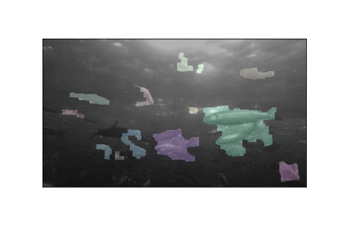

This is a Google colab demo that I worked on for a good portion of the day to play around with fish data.

The goal was to implement fish detection and tracking in the shortest amount of time possible.

It consists of two parts: segmentation and tracking, in separate notebooks.

The tracking relies on the Canny segmentation, which turned out to be not too great.

Nonetheless, the tracking works!

Anyway, it runs natively on colab, and the images were scraped from the Now Go Build youtube video: https://www.youtube.com/watch?v=YZ_qJ5JFD3I